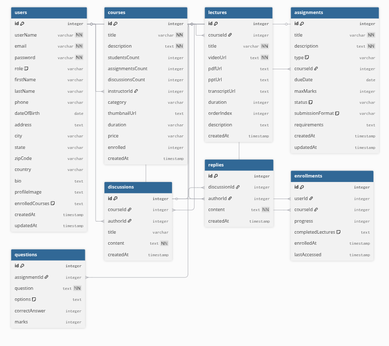

# AnthroLearn 🎓

## Learning Management System - Hackathon Project

# Project Description 📝

AnthroLearn is a comprehensive Learning Management System (LMS) developed for a hackathon competition. This platform enables seamless interaction between students, teachers, and administrators with features including course management, video lectures, assignments with auto-grading, real-time discussions, and AI-powered video summarization.

The platform is built using the **MERN stack** with modern features like Docker containerization, AWS deployment, and GitHub Actions CI/CD pipeline.

## � Team Members

- **M V Hemanth** - Full Stack Developer & DevOps
- **G Monish Reddy** - Testing & Deployment
- **D Bharath** - Frontend & Design

<hr/>

## Table of Contents

| Section                                        | Description                           |
| ---------------------------------------------- | ------------------------------------- |
| [AnthroLearn Features](#anthrolearn-features-) | 🎯 Key features and capabilities      |
| [Tech Stack](#tech-stack-)                     | 💻🔧 Technologies used in the project |
| [Project Structure](#project-structure-)       | 📁 Overview of project organization   |
| [System Architecture](#system-architecture-)   | � Overview of the system architecture |
| [Database Schema](#database-schema-)           | 🗂 Database models and relationships   |
| [React Features](#react-features-)             | ⚛️ React hooks and libraries used     |
| [Deployment](#deployment-)                     | � Docker and AWS deployment setup     |

## AnthroLearn Features 🎯

### 🎓 For Students:

- **Course Enrollment & Learning**: Browse and enroll in courses with interactive video lectures
- **Assignment System**: Complete assignments with auto-grading functionality
- **Video Player**: Universal video player supporting YouTube, Google Drive, and direct video links
- **AI Video Summarization**: Get AI-powered summaries of lecture videos using Gemini API
- **Progress Tracking**: Real-time progress tracking with mark-as-complete functionality
- **Dashboard**: Personalized dashboard with course progress and notifications

### 👨‍🏫 For Teachers:

- **Course Management**: Create, update, and manage courses with multimedia content
- **Assignment Creation**: Design assignments with auto-grading capabilities
- **Student Analytics**: Monitor student progress and engagement
- **Discussion Moderation**: Manage course discussions and student interactions

### 👨‍💼 For Administrators:

- **User Management**: Manage students, teachers, and system users
- **System Analytics**: Overview of platform usage and performance

## Tech Stack 💻🔧

### Frontend 🎨:

- **React.js** - Interactive user interface with hooks
- **Vite** - Fast build tool and development server
- **Tailwind CSS** - Utility-first CSS framework
- **React Router** - Client-side routing
- **Axios** - HTTP client for API calls
- **React Context** - State management for auth and courses
- **React Icons** - Comprehensive icon library

### Backend ⚙️:

- **Node.js** - JavaScript runtime environment
- **Express.js** - Web application framework
- **MongoDB** - NoSQL database
- **Mongoose** - MongoDB object modeling
- **JWT** - JSON Web Token authentication
- **Gemini AI API** - Video summarization AI service

### DevOps & Deployment 🚀:

- **Docker** - Containerization platform
- **AWS ECR** - Container registry
- **AWS EC2** - Cloud computing platform
- **GitHub Actions** - CI/CD pipeline
- **Docker Compose** - Multi-container orchestration

### Development Tools 🛠️:

- **ESLint** - Code linting
- **Git** - Version control
- **VS Code** - Development environment

## Project Structure 📁

```
lms-hackathon/
├── Backend/                    # Node.js Express server
│   ├── config/                # Database configuration
│   ├── controllers/           # API route handlers
│   ├── middleware/            # Authentication middleware
│   ├── models/               # MongoDB schemas
│   ├── routes/               # API routes
│   ├── utils/                # Utility functions
│   ├── index.js              # Server entry point
│   └── package.json          # Backend dependencies
├── Frontend/lms/             # React application
│   ├── src/
│   │   ├── components/       # Reusable React components
│   │   ├── pages/           # Page components
│   │   ├── context/         # React Context providers
│   │   └── utils/           # Frontend utilities
│   ├── public/              # Static assets
│   └── package.json         # Frontend dependencies
├── .github/workflows/        # GitHub Actions CI/CD
├── docker-compose.yaml       # Multi-container setup
├── Dockerfile.backend        # Backend container config
├── Dockerfile.frontend       # Frontend container config
└── README.md                # Project documentation
```

## System Architecture 🏰

AnthroLearn follows a modern **3-tier architecture** with clear separation of concerns:

### 🎨 **Frontend Layer**

- **React.js** with Vite for fast development and optimized builds
- **Tailwind CSS** for responsive and modern UI design
- **Context API** for state management (Auth & Course contexts)
- **React Router** for client-side navigation
- **Universal Video Player** supporting multiple video formats
- **Real-time progress tracking** with instant UI updates

### ⚙️ **Backend Layer**

- **Node.js & Express.js** RESTful API server
- **JWT Authentication** with middleware protection
- **Auto-grading system** for assignments
- **Gemini AI integration** for video summarization
- **File upload handling** with Multer
- **Real-time progress tracking** APIs

### 🛢️ **Database Layer**

- **MongoDB** with Mongoose ODM
- **Flexible schema design** for courses, users, and progress
- **Optimized queries** for performance
- **Data relationships** between users, courses, lectures, and progress

### 🚀 **Infrastructure Layer**

- **Docker containerization** for consistent deployments
- **AWS ECR** for container registry
- **AWS EC2** for production hosting
- **GitHub Actions** for automated CI/CD pipeline

## Database Schema 🗂

AnthroLearn uses a comprehensive MongoDB database design with 8 core collections to manage users, courses, lectures, assignments, and progress tracking.



### **Key Features:**

- **Relational Design**: Proper references between collections for data integrity
- **Progress Tracking**: Dedicated models for tracking lecture completion and course progress
- **Flexible Content**: Support for multiple content types (videos, assignments, discussions)
- **Auto-grading**: Assignment submission and grading system
- **User Management**: Comprehensive user profiles with role-based access

## React Features 🎣

### **React Hooks Used:**

- `useState` - Component state management
- `useEffect` - Side effects and lifecycle management
- `useContext` - Access to Auth and Course contexts
- `useParams` - URL parameter extraction
- `useNavigate` - Programmatic navigation
- `useRef` - DOM element references

### **Key React Libraries:**

- **React Router DOM** - Client-side routing and navigation
- **Axios** - HTTP client for API communication
- **React Icons** - Comprehensive icon library
- **React Hot Toast** - Toast notifications for user feedback

### **Custom Components:**

- **VideoPlayer** - Universal video player with format detection
- **VideoSummarizer** - AI-powered video summarization
- **AssignmentsTable** - Interactive assignment display
- **CourseCard** - Reusable course display component
- **Navigation Components** - Student/Teacher/Admin dashboards

## Deployment 🚀

### **Development Setup:**

```bash
# Clone the repository
git clone https://github.com/Hemanth42d/lms-hackathon.git
cd lms-hackathon

# Install backend dependencies
cd Backend
npm install

# Install frontend dependencies
cd ../Frontend/lms
npm install

# Set up environment variables
# Backend: Create .env file with MongoDB URI, JWT secret, Gemini API key
# Frontend: Create .env file with API URLs

# Start development servers
npm run dev # Frontend (port 5173)
npm start   # Backend (port 3000)
```

### **Docker Deployment:**

```bash
# Build and run with Docker Compose
docker-compose up --build

# Or build individual containers
docker build -f Dockerfile.backend -t lms-backend .
docker build -f Dockerfile.frontend -t lms-frontend .
```

### **Production Deployment:**

- **AWS ECR** for container registry
- **AWS EC2** for hosting
- **GitHub Actions** for automated CI/CD
- **Environment variables** managed securely

### **Key Environment Variables:**

```env
# Backend
MONGO_URI=your_mongodb_connection_string
JWT_ACCESS_TOKEN=your_jwt_secret
GEMINI_API_KEY=your_gemini_api_key
FRONTEND_URL=http://your-frontend-url

# Frontend
VITE_API_URL=http://your-backend-url
```

## Features Highlights 🌟

### **🎥 Advanced Video System:**

- Universal video player supporting YouTube, Google Drive, and direct video links
- Progress tracking with mark-as-complete functionality
- Real-time progress updates

### **📝 Auto-Grading Assignments:**

- Intelligent assignment evaluation system
- Instant feedback for students
- Grade tracking and analytics
- Submission management

### **💬 Discussion Forums:**

- Course-specific discussion boards
- Real-time interaction between students and teachers
- Threaded conversations and replies

### **📊 Analytics Dashboard:**

- Student progress tracking
- Course completion rates
- Assignment performance metrics
- Teacher insights and analytics

### **🔐 Security Features:**

- JWT-based authentication
- Role-based access control (Student/Teacher/Admin)
- Secure API endpoints
- Input validation and sanitization

---

## 🚀 **Hackathon Achievement**

This project was developed as part of a hackathon competition, showcasing:

- **Rapid Development** - Complete LMS built in hackathon timeframe
- **Team Collaboration** - Effective coordination between 3 team members
- **Modern Architecture** - Implementation of industry-standard practices
- **Scalable Design** - Built for future enhancements and growth
- **Innovation** - AI integration and modern UX/UI design

---

_Developed with ❤️ by Team AnthroLearn for the Hackathon 2025_
